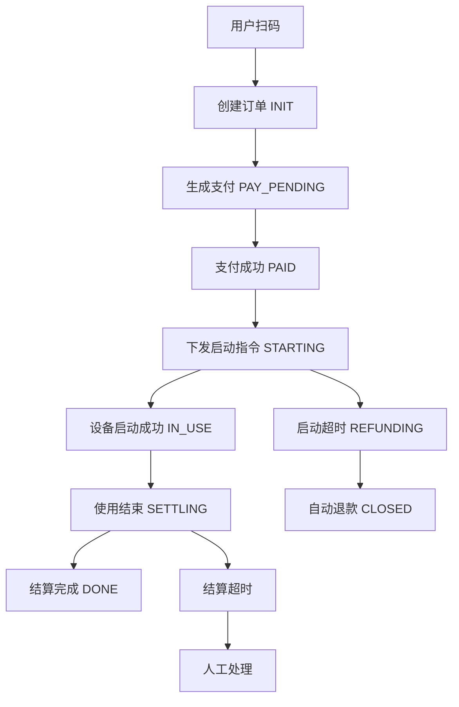

# 亮车惠自助洗车系统 - 项目总体设计文档

> **文档版本**: v1.0  
> **创建时间**: 2025-09-04  
> **适用范围**: 开发团队、产品团队、运维团队  
> **文档目标**: 统一项目理解，指导开发实施

---

## 📖 文档导航

| 模块 | 描述 | 详细文档 |
|------|------|----------|
| 项目概览 | 背景、目标、核心价值 | 本文档 |
| 系统架构 | 技术栈、部署架构 | 本文档 + `README.md` |
| 业务流程 | 订单状态机、设备控制 | `state_machines.md` |
| 功能矩阵 | 三端功能详细清单 | 本文档 |
| 第三方集成 | 微信、智链物联、通知 | `third_party_integrations.md` |
| IoT设备对接 | 设备协议、数据映射 | `iot_mapping.md` |
| 环境配置 | 部署参数、密钥配置 | `env_config_doc.md` |

---

## 🎯 项目核心定位

### 业务定位
**亮车惠自助洗车系统** - 基于微信生态的智能自助洗车SaaS平台

### 核心价值主张
- **用户价值**: 扫码即用，24小时自助洗车，微信支付便捷
- **商户价值**: 降本增效，数字化运营，多渠道收益
- **平台价值**: 统一管控，规模化运营，数据驱动决策

### 商业模式
- **B2B2C模式**: 平台→商户→用户的三级服务体系
- **收入来源**: 平台抽成、设备租赁、增值服务
- **增长策略**: 充值赠送、优惠券、新人福利促复购

---

## 🏗️ 系统架构总览

### 技术栈
```
前端: Vue3 + TypeScript + Vite
后端: Node.js + NestJS + TypeScript  
数据库: MySQL 8.0 + Redis 6.0
部署: Docker + Docker Compose
支付: 微信支付(JSAPI) + 余额系统
IoT: 智链物联设备协议
通知: 微信模板消息 + 腾讯云短信
```

### 部署架构
```
nginx (反向代理)
├── lch-platform:5601  (平台管理前端)
├── lch-merchant:5602  (商户管理前端) 
├── lch-backend:5603   (后端API)
└── docs:5604          (API文档)

数据存储
├── MySQL:3306         (业务数据)
└── Redis:6379         (缓存/会话)
```

### 核心服务模块
```
lch-backend/
├── auth/           # 认证授权(JWT + 微信OAuth)
├── users/          # 用户管理
├── merchants/      # 商户管理  
├── devices/        # 设备管理
├── orders/         # 订单管理
├── payments/       # 支付管理
├── notifications/  # 消息通知
└── common/         # 公共模块
```

---

## 👥 用户角色与权限矩阵

| 角色类型 | 角色细分 | 核心权限 | 访问端 |
|----------|----------|----------|--------|
| **最终用户** | 车主用户 | 扫码洗车、订单管理、充值消费 | 微信H5 |
| **商户角色** | 商户老板 | 全店管理、财务提现、员工管理 | PC + H5 |
|  | 店长 | 设备管理、订单查看、营销配置 | PC + H5 |
|  | 店员 | 设备状态查看、异常处理 | H5 |
| **平台角色** | 超级管理员 | 全平台管理、系统配置 | PC + H5 |
|  | 财务管理员 | 结算审核、对账管理 | PC |
|  | 运维管理员 | 设备监控、异常处理 | PC + H5 |

---

## 🔄 核心业务流程

### 订单完整生命周期


### 关键时序与超时策略
- **支付超时**: 15分钟未支付 → 订单关闭
- **启动超时**: 30秒未收到设备响应 → 自动退款
- **结算超时**: 60秒未收到结算上报 → 人工介入
- **最长使用**: 根据设备配置参数自动结束

### 设备状态管理
```
offline → online → busy → online
   ↑         ↓        ↓      ↓
   └─────────┴────────┴──────┘
```

---

## 📱 功能模块详细矩阵

### 1. 用户端功能 (微信公众号H5)

| 功能模块 | 核心功能 | 页面/组件 | 关键流程 |
|----------|----------|-----------|----------|
| **身份认证** | 微信OAuth登录 | 登录页 | 微信授权→获取openid→创建/绑定账户 |
| **门店服务** | 附近门店、设备状态 | 首页、门店详情 | 定位→门店列表→设备选择 |
| **洗车服务** | 扫码启动、实时控制 | 设备控制页 | 扫码→支付→启动→使用→结算 |
| **支付体系** | 微信支付、余额支付 | 支付页、充值页 | 订单金额→选择支付方式→完成支付 |
| **会员权益** | 充值赠送、优惠券 | 充值中心、优惠券页 | 充值套餐→赠送余额→优惠券使用 |
| **订单管理** | 历史订单、退款申请 | 订单列表、订单详情 | 订单查询→详情查看→异常申诉 |
| **个人中心** | 账户信息、余额管理 | 个人中心 | 信息展示→余额查询→设置管理 |

### 2. 商户端功能 (PC + H5双端)

| 功能模块 | 核心功能 | 适用端 | 关键流程 |
|----------|----------|--------|----------|
| **商户资料** | 门店信息、资质管理 | PC | 基本信息→营业执照→结算账户 |
| **设备管理** | 绑定设备、状态监控 | PC + H5 | 设备绑定→状态监控→异常告警 |
| **订单流水** | 营收统计、订单查询 | PC + H5 | 订单列表→营收报表→退款处理 |
| **财务管理** | 收益查看、提现申请 | PC + H5 | 收益统计→提现申请→到账查询 |
| **员工管理** | 角色分配、权限控制 | PC | 员工添加→角色设置→权限分配 |
| **营销工具** | 充值套餐、优惠券 | PC | 套餐配置→优惠券发放→效果统计 |
| **数据分析** | 设备利用率、用户分析 | PC | 使用统计→趋势分析→运营优化 |

### 3. 平台端功能 (PC + H5双端)

| 功能模块 | 核心功能 | 适用端 | 关键流程 |
|----------|----------|--------|----------|
| **商户管理** | 入驻审核、商户监管 | PC | 申请审核→资质验证→状态管理 |
| **设备管理** | 全平台监控、远程控制 | PC + H5 | 设备注册→状态监控→远程操作 |
| **订单管理** | 全局订单、异常处理 | PC + H5 | 订单汇总→异常订单→退款审核 |
| **财务管理** | 分润结算、提现审核 | PC | 分润配置→结算处理→提现审批 |
| **系统配置** | 参数配置、模板管理 | PC | 系统参数→消息模板→规则配置 |
| **数据统计** | 平台数据、商户排行 | PC | 数据大屏→趋势分析→报表导出 |
| **告警管理** | 异常监控、通知推送 | PC + H5 | 告警规则→实时监控→通知推送 |

---

## 🔌 第三方集成架构

### 微信生态集成
```
微信公众号平台
├── OAuth 2.0 授权登录
├── JSAPI 支付接口  
├── 模板消息推送
├── 微信定位 API
└── 客服接口
```

### 智链物联设备协议
```
设备通信协议
├── 上报事件
│   ├── online/offline (设备上下线)
│   ├── cmd=09 (启动成功上报)  
│   ├── cmd=10 (结算完成上报)
│   ├── cmd=13 (配置/ICCID上报)
│   └── cmd=19 (异常告警上报)
└── 下发指令
    ├── 启动设备 (cmd=09)
    └── 停止设备 (预留)
```

### 通知服务架构
```
统一通知网关
├── 微信模板消息 (主通道)
├── 腾讯云短信 (兜底通道)
├── 场景化路由
├── 频控去重
└── 失败重试
```

---

## 🛡️ 安全与可靠性设计

### 异常处理机制
| 异常场景 | 检测机制 | 处理策略 | 补偿措施 |
|----------|----------|----------|----------|
| 设备启动失败 | 30秒超时检测 | 自动退款 | 订单状态→CLOSED |
| 结算数据丢失 | 60秒超时检测 | 人工介入 | 兜底结算单 |
| 支付回调失败 | 重试机制 | 3次重试 | 人工核对 |
| 设备离线异常 | 心跳检测 | 实时告警 | 短信+微信通知 |

### 数据安全保障
- **支付安全**: 微信支付官方SDK、HTTPS传输、签名验证
- **隐私保护**: 手机号脱敏、敏感信息加密存储
- **访问控制**: JWT令牌、角色权限、API限流
- **审计追踪**: 操作日志、财务流水、完整链路追踪

### 监控告警体系
```
监控层级
├── 业务监控 (订单异常、支付失败)
├── 设备监控 (在线状态、设备告警)  
├── 系统监控 (API响应、数据库性能)
└── 安全监控 (异常访问、数据泄露)
```

---

## 📊 关键业务指标

### 用户端指标
- **转化率**: 扫码→支付→完成使用的转化漏斗
- **复购率**: 用户重复使用频率、充值转化率
- **满意度**: 订单完成率、退款率、投诉率

### 商户端指标  
- **运营效率**: 设备利用率、营收增长、成本控制
- **服务质量**: 设备故障率、响应时间、用户评价
- **财务健康**: 提现及时率、分润准确性、对账一致性

### 平台端指标
- **规模增长**: 商户数量、设备覆盖、交易规模
- **平台质量**: 系统稳定性、数据准确性、服务可用性
- **风险控制**: 异常订单率、资金安全、合规达标

---

## 🚀 开发实施指南

### 开发优先级
1. **Phase 1 - 核心功能**: 用户扫码支付、设备控制、基础订单流程
2. **Phase 2 - 管理后台**: 商户管理、平台管理、财务结算
3. **Phase 3 - 增值功能**: 充值赠送、优惠券、数据分析
4. **Phase 4 - 优化增强**: 营销工具、智能告警、运营优化

### 技术实施要点
- **前端开发**: Vue3组合式API、TypeScript强类型、响应式设计
- **后端开发**: NestJS模块化、TypeORM数据操作、Redis缓存优化
- **API设计**: RESTful规范、统一错误码、接口版本管理
- **数据库设计**: 主键规范、索引优化、读写分离、备份策略

### 测试策略
- **单元测试**: 业务逻辑测试覆盖率>80%
- **集成测试**: 第三方接口、支付流程、设备协议
- **端到端测试**: 完整业务流程、异常场景、压力测试
- **安全测试**: 权限验证、数据安全、接口安全

---

## 📋 项目交付清单

### 代码交付
- [ ] 后端服务 (lch-backend)
- [ ] 平台前端 (lch-platform) 
- [ ] 商户前端 (lch-merchant)
- [ ] 用户H5页面 (集成在后端)
- [ ] 数据库脚本
- [ ] Docker部署配置

### 文档交付  
- [ ] API接口文档
- [ ] 数据库设计文档
- [ ] 部署运维文档
- [ ] 用户操作手册
- [ ] 管理员使用指南

### 测试交付
- [ ] 测试用例文档
- [ ] 性能测试报告  
- [ ] 安全测试报告
- [ ] 用户验收测试

---

## 🔗 相关文档索引

| 文档名称 | 用途 | 读者 |
|----------|------|------|
| `README.md` | 项目介绍、快速开始 | 所有人 |
| `project_requirements.md` | 详细需求说明 | 产品、开发 |
| `state_machines.md` | 业务流程、状态机 | 开发、测试 |
| `iot_mapping.md` | 设备协议对接 | 后端开发 |
| `third_party_integrations.md` | 第三方集成 | 开发、运维 |
| `env_config_doc.md` | 环境配置说明 | 运维、测试 |
| `user_h_5.md` | 用户端详细功能 | 前端开发 |
| `merchant_admin_pc.md` | 商户PC端功能 | 前端开发 |
| `merchant_admin_h_5.md` | 商户H5端功能 | 前端开发 |
| `platform_admin_pc.md` | 平台PC端功能 | 前端开发 |
| `platform_admin_h_5.md` | 平台H5端功能 | 前端开发 |

---

**📌 文档维护说明**:
- 本文档作为项目总纲，所有功能变更需同步更新
- 详细实现细节请参考对应的专项文档  
- 文档版本与代码版本保持同步更新
- 重大变更需要团队review确认

---

*📅 最后更新: 2025-09-04*  
*👥 维护团队: 亮车惠开发团队*